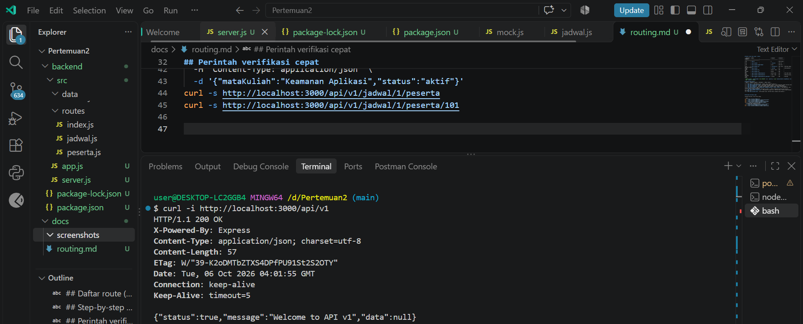
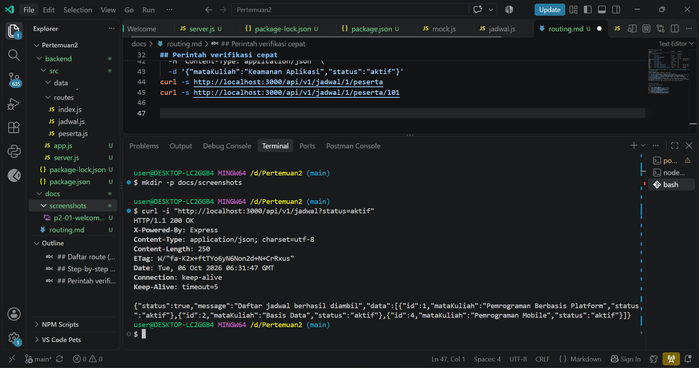
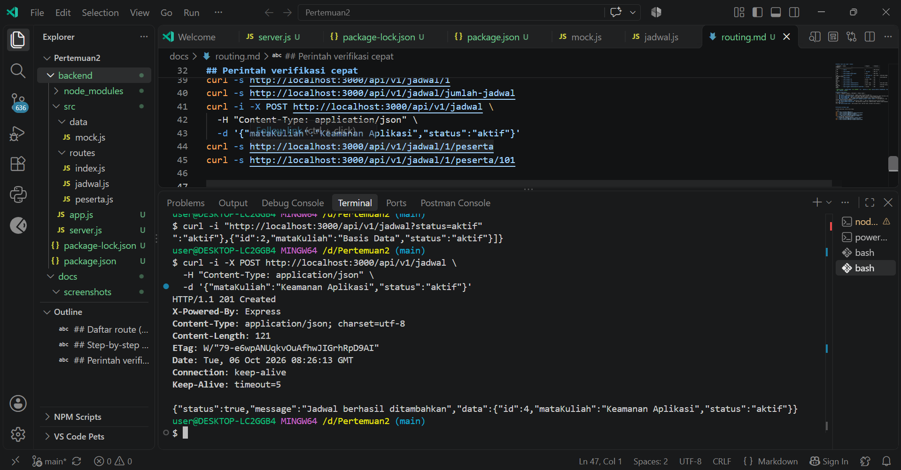
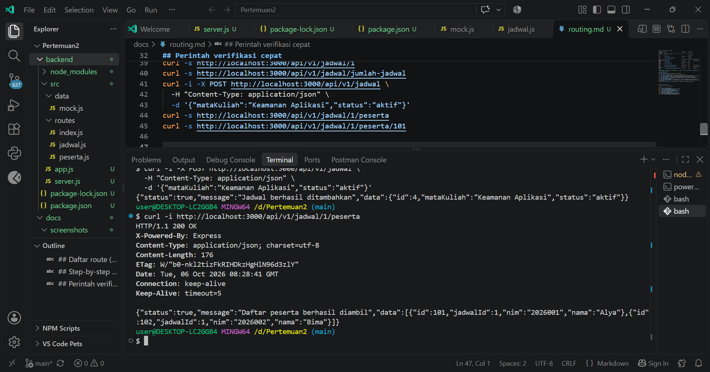
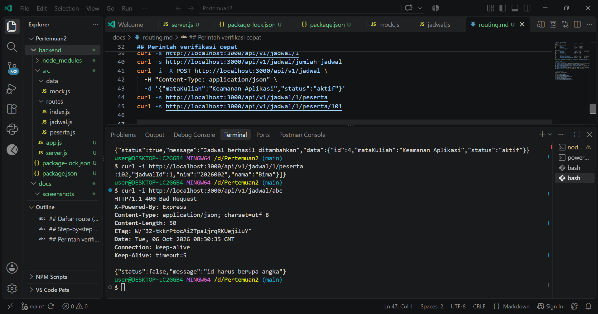

## Daftar route (asal input + status)

| **Method** | **URL**                                       | **Input**       | **Sukses**  | **Gagal**                         |
| :--------- | :-------------------------------------------- | :-------------- | :---------- | :-------------------------------- |
| GET        | `/api/v1`                                     | —               | 200 welcome | —                                 |
| GET        | `/api/v1/jadwal`                              | `req.query`     | 200 list    | —                                 |
| GET        | `/api/v1/jadwal/jumlah-jadwal`                | array           | 200 total   | —                                 |
| GET        | `/api/v1/jadwal/:id`                          | `req.params.id` | 200 1 data  | 400 bukan angka, 404 tidak ketemu |
| POST       | `/api/v1/jadwal`                              | `req.body`      | 201         | 400 mataKuliah kosong             |
| PUT        | `/api/v1/jadwal/:id`                          | params + body   | 200         | 404                               |
| DELETE     | `/api/v1/jadwal/:id`                          | params          | 200         | 404                               |
| GET        | `/api/v1/jadwal/:jadwalId/peserta`            | params induk    | 200         | 404 induk tidak ada               |
| POST       | `/api/v1/jadwal/:jadwalId/peserta`            | induk + body    | 201         | 400 body kosong, 404 induk        |
| GET        | `/api/v1/jadwal/:jadwalId/peserta/:pesertaId` | 2 params        | 200         | 404 beda jadwal                   |

> Catatan urutan: `/jumlah-jadwal` harus SEBELUM `/:id`. `peserta.js` wajib `express.Router({ mergeParams: true })` agar `jadwalId` terbaca.

## Step-by-step testing
| **No.** | **Request (step)** | **Harapan** | **Hasil saya** |
| ------: | :--- | :--- | :--- |
| 1 | `GET /api/v1` | 200 pesan welcome | 200 OK, pesan "Welcome to API v1" |
| 2 | `GET /api/v1/jadwal?status=aktif` | 200 hanya data aktif | 200 OK, hanya menampilkan jadwal berstatus aktif |
| 3 | `GET /api/v1/jadwal/abc` | 400 id harus angka | 400 Bad Request, "id harus berupa angka" |
| 4 | `GET /api/v1/jadwal/99` | 404 jadwal tidak ditemukan | 404 Not Found, "Jadwal tidak ditemukan" |
| 5 | `POST /api/v1/jadwal` body `{"mataKuliah":"Keamanan Aplikasi","status":"aktif"}` | 201 objek baru | 201 Created, jadwal berhasil ditambahkan |
| 6 | `GET /api/v1/jadwal/1/peserta` | 200 peserta jadwal 1 | 200 OK, menampilkan peserta Alya dan Bima |
| 7 | `GET /api/v1/jadwal/1/peserta/103` | 404 peserta di jadwal lain | 404 Not Found, "Peserta tidak ditemukan pada jadwal ini" |
| 8 | `GET /api/v1/alamat-salah` | 404 fallback route | 404 Not Found, fallback route berhasil |


## Perintah verifikasi cepat

Jalankan berurutan, server harus hidup:

```bash
curl -s http://localhost:3000/api/v1
curl -s "http://localhost:3000/api/v1/jadwal?status=aktif"
curl -s http://localhost:3000/api/v1/jadwal/1
curl -s http://localhost:3000/api/v1/jadwal/jumlah-jadwal
curl -i -X POST http://localhost:3000/api/v1/jadwal \
  -H "Content-Type: application/json" \
  -d '{"mataKuliah":"Keamanan Aplikasi","status":"aktif"}'
curl -s http://localhost:3000/api/v1/jadwal/1/peserta
curl -s http://localhost:3000/api/v1/jadwal/1/peserta/101


Screenshot wajib 5 gambar, simpan d











- Perbandingan dengan Sistem ATLAS

API latihan menggunakan status HTTP 404 untuk resource atau route
yang tidak ditemukan. Status 404 sesuai dengan semantik HTTP karena
menunjukkan bahwa resource atau endpoint yang diminta tidak tersedia.

Pada sistem ATLAS asli terdapat perilaku lama yang mengembalikan
status 500 dengan pesan "Api tidak tersedia" ketika path API tidak
cocok.

Perbedaan tersebut menunjukkan bahwa implementasi latihan menggunakan
status code yang lebih tepat untuk kasus route atau resource yang tidak
ditemukan. Route latihan tidak diubah menjadi 500 karena tujuan latihan
adalah memahami penggunaan status code HTTP yang sesuai.


-Masalah yang Sering Muncul

| Gejala                               | Penyebab                        | Perbaikan                                       |
| ------------------------------------ | ------------------------------- | ----------------------------------------------- |
| `Cannot find module 'express'`       | Dependency belum terpasang      | Jalankan `npm install` di backend               |
| `EADDRINUSE`                         | Port 3000 sedang digunakan      | Hentikan server lama atau gunakan port lain     |
| `req.body` undefined                 | `express.json()` belum dipasang | Tambahkan `express.json()` sebelum router       |
| `/jumlah-jadwal` dibaca sebagai `id` | Route `/:id` terlalu awal       | Letakkan route statis lebih dahulu              |
| `req.params.jadwalId` undefined      | Tidak menggunakan `mergeParams` | Gunakan `express.Router({ mergeParams: true })` |
| Semua route 404                      | Prefix router salah             | Periksa `/api/v1` + `/jadwal` + path            |
| Data hilang setelah restart          | Data masih berupa array memori  | Perilaku normal pada Pertemuan 2                |
