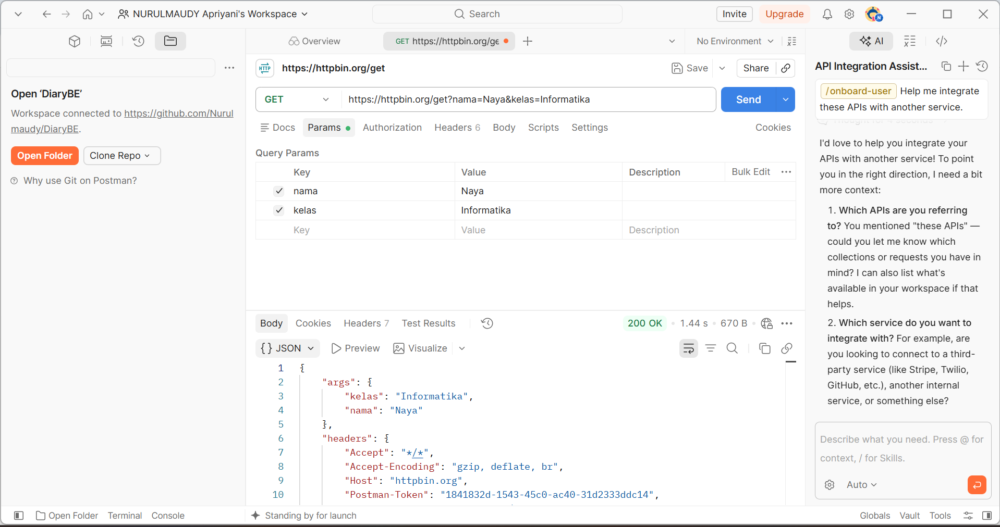
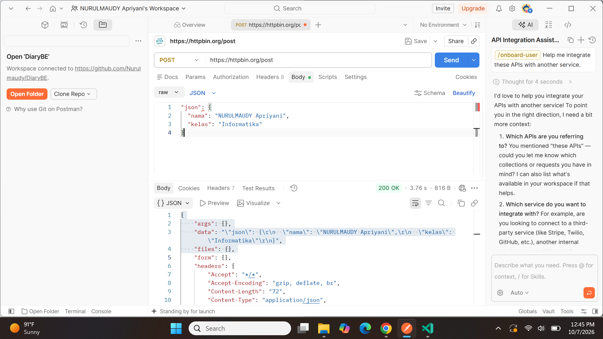

# Tugas Mandiri 1 — Mengenal HTTP Method dan Endpoint

**Nama:** NURULMAUDY Apriyani
**NIM:** 2024520057
**Prodi:** Informatika
**Universitas:** Universitas Madura

## Hasil Pengujian

| No | Method | Endpoint  | Data yang dikirim                                            | Status   | Hasil                                                                              |
| -: | :----- | :-------- | :----------------------------------------------------------- | :------- | :--------------------------------------------------------------------------------- |
|  1 | GET    | `/get`    | Query parameter `nama=NURULMAUDY Apriyani&kelas=Informatika` | `200 OK` | Server mengembalikan query parameter yang dikirim serta informasi request lainnya. |
|  2 | POST   | `/post`   | JSON/body `nama=NURULMAUDY Apriyani`, `kelas=Informatika`    | `200 OK` | Server mengembalikan data JSON yang dikirim melalui body.                          |
|  3 | PUT    | `/put`    | JSON/body `nama=NURULMAUDY Apriyani`, `kelas=Informatika`    | `200 OK` | Server mengembalikan data JSON dan informasi request PUT.                          |
|  4 | PATCH  | `/patch`  | JSON/body `nama=NURULMAUDY Apriyani`, `kelas=Informatika`    | `200 OK` | Server mengembalikan data JSON dan informasi request PATCH.                        |
|  5 | DELETE | `/delete` | -                                                            | `200 OK` | Server mengembalikan informasi request DELETE yang diterima.                       |

---

## 1. GET `/get`

**HTTP Method:** `GET`

**URL Lengkap:**

```text
https://httpbin.org/get?nama=NURULMAUDY%20Apriyani&kelas=Informatika
```

**Tujuan Endpoint:**
Endpoint `/get` digunakan untuk menguji request GET. Pada pengujian ini digunakan query parameter untuk mengirimkan data nama dan kelas melalui URL.

**Data yang Dikirim:**

```text
nama = NURULMAUDY Apriyani
kelas = Informatika
```

**Status:** `200 OK`

**Response Body:**

```json
{
  "args": {
    "nama": "NURULMAUDY Apriyani",
    "kelas": "Informatika"
  }
}
```

**Penjelasan:**
Server HTTPBin menampilkan kembali informasi request yang diterima. Data `nama` dan `kelas` dapat dilihat pada bagian `args`.

### Screenshot Pengujian GET



---

## 2. POST `/post`

**HTTP Method:** `POST`

**URL Lengkap:**

```text
https://httpbin.org/post
```

**Tujuan Endpoint:**
Endpoint `/post` digunakan untuk menguji request POST dengan mengirimkan data melalui body request.

**Data yang Dikirim:**

```json
{
  "nama": "NURULMAUDY Apriyani",
  "kelas": "Informatika"
}
```

**Status:** `200 OK`

**Response Body:**

```json
{
  "json": {
    "nama": "NURULMAUDY Apriyani",
    "kelas": "Informatika"
  }
}
```

**Penjelasan:**
Data JSON dikirim melalui body request. HTTPBin menampilkan kembali data tersebut pada bagian `json` sehingga dapat diketahui bahwa server menerima data yang dikirim.

### Screenshot Pengujian POST



---

## 3. PUT `/put`

**HTTP Method:** `PUT`

**URL Lengkap:**

```text
https://httpbin.org/put
```

**Tujuan Endpoint:**
Endpoint `/put` digunakan untuk menguji request PUT.

**Data yang Dikirim:**

```json
{
  "nama": "NURULMAUDY Apriyani",
  "kelas": "Informatika"
}
```

**Status:** `200 OK`

**Response Body:**

```json
{
  "json": {
    "nama": "NURULMAUDY Apriyani",
    "kelas": "Informatika"
  }
}
```

**Penjelasan:**
Data JSON dikirim melalui body menggunakan method PUT. HTTPBin menampilkan kembali data tersebut sebagai informasi request yang diterima server.

---

## 4. PATCH `/patch`

**HTTP Method:** `PATCH`

**URL Lengkap:**

```text
https://httpbin.org/patch
```

**Tujuan Endpoint:**
Endpoint `/patch` digunakan untuk menguji request PATCH.

**Data yang Dikirim:**

```json
{
  "nama": "NURULMAUDY Apriyani",
  "kelas": "Informatika"
}
```

**Status:** `200 OK`

**Response Body:**

```json
{
  "json": {
    "nama": "NURULMAUDY Apriyani",
    "kelas": "Informatika"
  }
}
```

**Penjelasan:**
Data JSON dikirim melalui body menggunakan method PATCH. HTTPBin menampilkan kembali data tersebut pada response body.

---

## 5. DELETE `/delete`

**HTTP Method:** `DELETE`

**URL Lengkap:**

```text
https://httpbin.org/delete
```

**Tujuan Endpoint:**
Endpoint `/delete` digunakan untuk menguji request DELETE.

**Data yang Dikirim:**
Tidak ada.

**Status:** `200 OK`

**Response Body:**

HTTPBin mengembalikan informasi mengenai request DELETE yang diterima, seperti method, header, URL, dan informasi request lainnya.

**Penjelasan:**
Request DELETE digunakan untuk menguji permintaan penghapusan resource. Pada pengujian HTTPBin ini tidak ada data yang dikirim melalui body.

---

## Kesimpulan

Berdasarkan hasil pengujian, setiap HTTP method memiliki fungsi yang berbeda. GET digunakan untuk mengirim data melalui query parameter pada URL, sedangkan POST, PUT, dan PATCH dapat mengirim data JSON melalui body request. DELETE digunakan untuk menguji request penghapusan. HTTPBin menampilkan kembali informasi request yang diterima server sehingga dapat digunakan untuk memahami hubungan antara request dan response.

## Dokumentasi Pengujian

Dua tangkapan layar hasil pengujian menggunakan Postman telah dilampirkan, yaitu:

* `tugas1-get.png` — hasil pengujian GET.
* `tugas1-post.png` — hasil pengujian POST.
