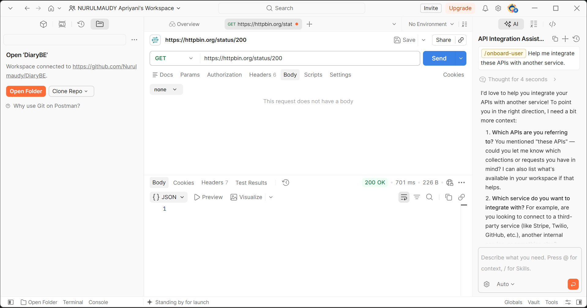
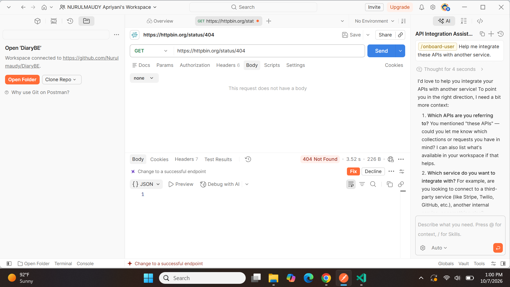
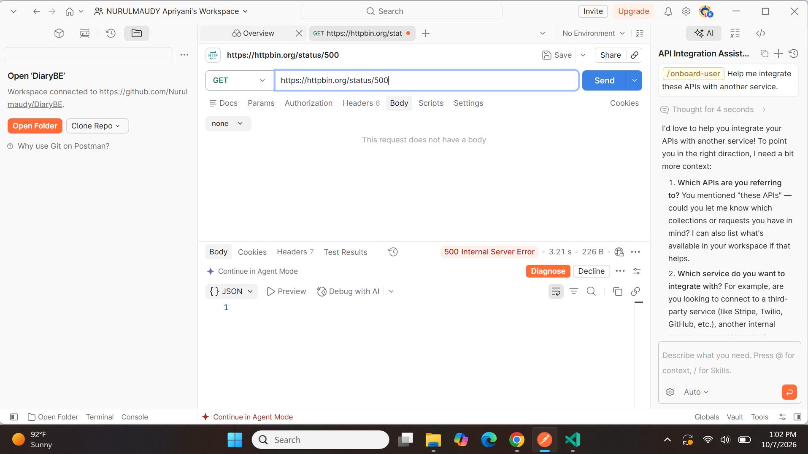

# Tugas Mandiri 2 — Memahami HTTP Status Code

**Nama:** NURULMAUDY Apriyani  
**NIM:** 2024520057  
**Prodi:** Informatika  
**Universitas:** Universitas Madura  

## Hasil Pengujian

| **Status Code** | **Arti** | **Hasil Pengujian** | **Kapan Digunakan** |
| --------------: | :------- | :------------------ | :------------------ |
| 200 | OK | `200 OK` | Saat request berhasil diproses oleh server. |
| 201 | Created | `201 Created` | Saat data atau resource baru berhasil dibuat. |
| 400 | Bad Request | `400 Bad Request` | Saat request yang dikirim client tidak valid atau memiliki format yang salah. |
| 401 | Unauthorized | `401 Unauthorized` | Saat pengguna belum melakukan login atau informasi autentikasinya tidak valid. |
| 403 | Forbidden | `403 Forbidden` | Saat pengguna sudah dikenali tetapi tidak mempunyai izin untuk mengakses resource tertentu. |
| 404 | Not Found | `404 Not Found` | Saat resource, data, atau endpoint yang diminta tidak ditemukan. |
| 500 | Internal Server Error | `500 Internal Server Error` | Saat terjadi kesalahan internal ketika server memproses request. |

## Jawaban Pertanyaan

### 1. Apa perbedaan makna kode `400` dan `404`? Berikan satu contoh keadaan untuk masing-masing kode.

Kode `400 Bad Request` menunjukkan bahwa request yang dikirim oleh client tidak valid sehingga server tidak dapat memprosesnya dengan benar. Contohnya, client mengirim data dengan format JSON yang salah atau parameter yang diberikan tidak sesuai dengan yang dibutuhkan oleh server.

Sedangkan kode `404 Not Found` menunjukkan bahwa request sudah diterima oleh server, tetapi resource atau endpoint yang diminta tidak ditemukan. Contohnya, pengguna mengakses URL `/api/produk/999`, tetapi data produk dengan ID tersebut tidak tersedia.

### 2. Apa perbedaan makna kode `401` dan `403` dalam pemeriksaan identitas dan hak akses pengguna?

Kode `401 Unauthorized` berkaitan dengan proses autentikasi atau pemeriksaan identitas pengguna. Status ini dapat muncul ketika pengguna belum login, token tidak diberikan, atau token yang digunakan sudah tidak valid. Artinya, server belum dapat memastikan bahwa pengguna memiliki identitas yang sah.

Sedangkan kode `403 Forbidden` menunjukkan bahwa pengguna sudah berhasil dikenali atau diautentikasi, tetapi pengguna tersebut tidak mempunyai hak atau izin untuk mengakses resource tertentu. Contohnya, pengguna biasa mencoba membuka halaman yang hanya dapat diakses oleh admin.

### 3. Mengapa `500` menunjukkan masalah pada sisi server?

Kode `500 Internal Server Error` menunjukkan bahwa terjadi kesalahan internal ketika server sedang memproses request. Kesalahan tersebut dapat disebabkan oleh bug pada program, kesalahan konfigurasi server, masalah koneksi database, atau proses pada server yang mengalami kegagalan.

Jadi, kode `500` umumnya bukan disebabkan oleh kesalahan pengguna dalam mengirim request, tetapi menunjukkan bahwa server mengalami masalah saat menjalankan proses yang diminta.

### 4. Apakah setiap respons kesalahan HTTP menunjukkan kerusakan pada server? Jelaskan alasan Anda dengan memberikan contoh.

Tidak, setiap respons kesalahan HTTP tidak berarti server mengalami kerusakan. Beberapa error terjadi karena request dari client tidak sesuai atau pengguna tidak mempunyai akses terhadap resource.

Contohnya, kode `400 Bad Request` dapat terjadi karena data yang dikirim client memiliki format yang salah. Kode `401 Unauthorized` dapat terjadi karena pengguna belum login atau token autentikasinya tidak valid. Kode `403 Forbidden` terjadi ketika pengguna tidak memiliki izin untuk mengakses resource, sedangkan `404 Not Found` terjadi ketika resource atau endpoint yang diminta tidak tersedia.

Berbeda dengan kode `500 Internal Server Error` yang menunjukkan adanya masalah internal pada server ketika memproses request. Jadi, error `4xx` tidak selalu berarti server rusak, sedangkan error `5xx` lebih berkaitan dengan masalah pada sisi server.

## Bukti Pengujian

### Status Code 200

### Status Code 404

### Status Code 500

