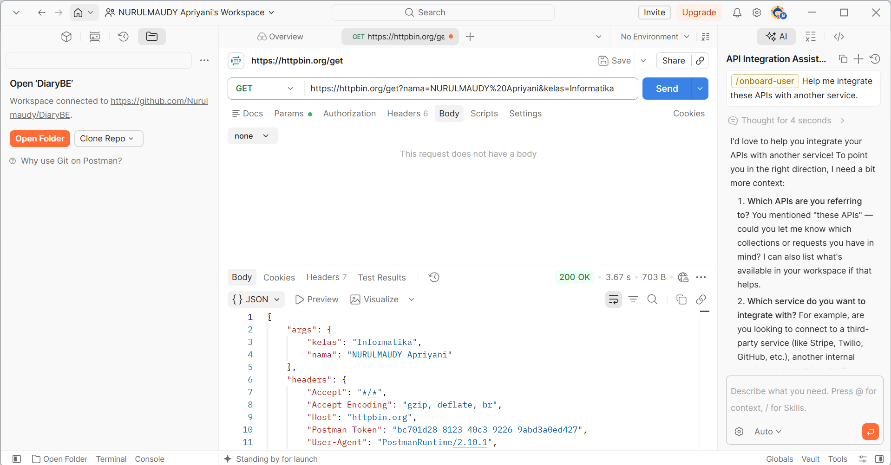
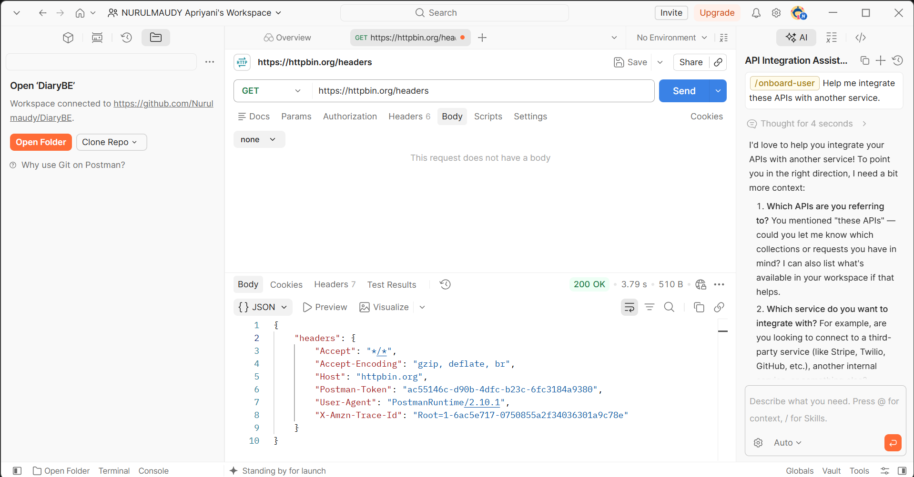

# Tugas Mandiri 3 — Memahami Request dan Response

**Nama:** NURULMAUDY Apriyani  
**NIM:** 2024520057  
**Prodi:** Informatika  
**Universitas:** Universitas Madura  

## Hasil Pengujian

| **No** | **Endpoint** | **Method** | **Data yang Dikirim** | **Hasil Pengujian** |
|------:|:-------------|:-----------|:-----------------------|:--------------------|
| 1 | `https://httpbin.org/get` | GET | `nama=NURULMAUDY Apriyani`, `kelas=Informatika` | Parameter `nama` dan `kelas` diterima dan ditampilkan pada response. |
| 2 | `https://httpbin.org/headers` | GET | HTTP Header | Server menampilkan header yang diterima dari client. |

## Jawaban Pertanyaan

### 1. Apa yang dimaksud dengan permintaan (request), dan pihak mana yang mengirimkannya?

Request adalah permintaan yang dikirim oleh client kepada server untuk meminta data atau melakukan suatu proses. Pada pengujian ini, Postman bertindak sebagai client yang mengirim request kepada server HTTPBin.

### 2. Apa yang dimaksud dengan respons (response), dan pihak mana yang mengirimkannya?

Response adalah balasan yang diberikan oleh server setelah menerima dan memproses request dari client. Pada pengujian ini, HTTPBin mengirimkan response kembali kepada Postman.

### 3. Apa fungsi query parameter? Jelaskan menggunakan parameter `nama` dan `kelas` pada pengujian Anda.

Query parameter digunakan untuk mengirimkan informasi tambahan kepada server melalui URL. Pada pengujian ini terdapat parameter `nama` dan `kelas`. Nilai tersebut dikirim melalui URL dan kemudian ditampilkan kembali oleh HTTPBin pada response.

### 4. Apa fungsi HTTP header? Sebutkan satu header yang terlihat pada hasil pengujian dan jelaskan informasi yang dimuatnya.

HTTP header berfungsi untuk memberikan informasi tambahan dalam komunikasi antara client dan server. Salah satu header yang terlihat adalah `User-Agent`, yang memberikan informasi mengenai aplikasi atau client yang digunakan untuk mengirim request.

### 5. Apa perbedaan penempatan data pada query parameter di URL dan pada body permintaan?

Query parameter ditempatkan pada URL setelah tanda `?`, sedangkan data pada body ditempatkan di dalam isi request. Query parameter biasanya digunakan untuk data sederhana seperti pencarian atau filter, sedangkan body biasanya digunakan untuk mengirim data yang lebih banyak, seperti data JSON pada request `POST` atau `PUT`.

## Bukti Pengujian

### Pengujian Endpoint `/get`

### Pengujian Endpoint `/headers`

