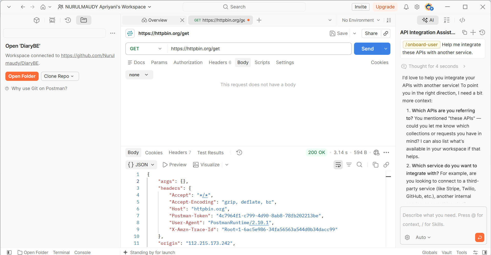
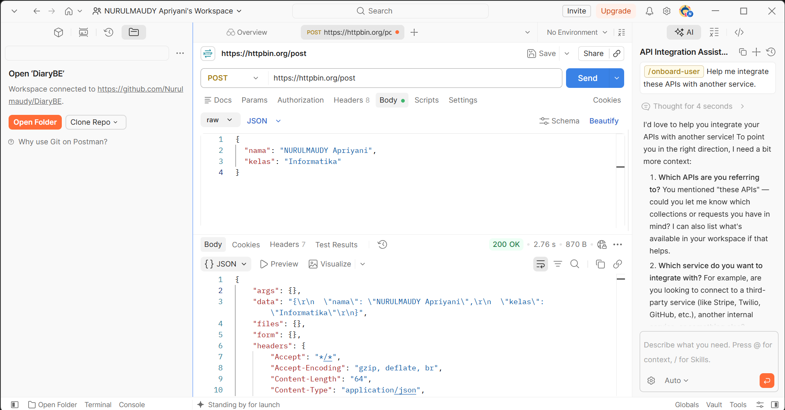
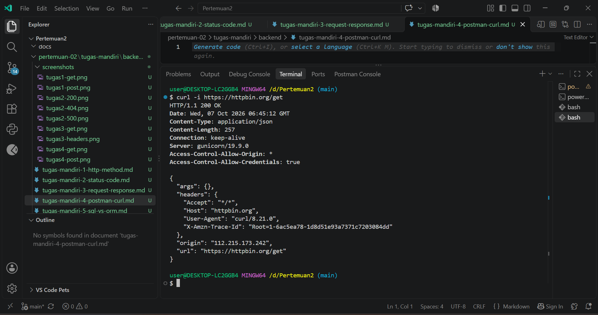
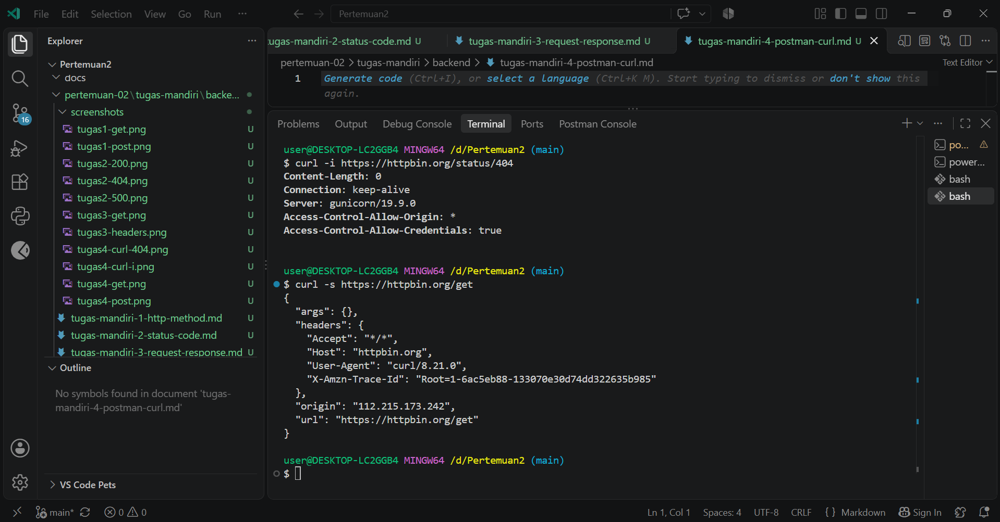

# Tugas Mandiri 4 — Pengujian API dengan Postman dan curl

**Nama:** NURULMAUDY Apriyani  
**NIM:** 2024520057  
**Prodi:** Informatika  
**Universitas:** Universitas Madura  

## A. Pengujian Menggunakan Postman

### 1. GET

**URL:**

```text
https://httpbin.org/get
```

Hasil pengujian menunjukkan bahwa request `GET` berhasil dikirim ke HTTPBin. Pada response terdapat bagian `args` yang digunakan untuk menampilkan query parameter. Karena tidak ada query parameter yang ditambahkan, bagian `args` bernilai kosong.

### 2. POST

**URL:**

```text
https://httpbin.org/post
```

**JSON yang dikirim:**

```json
{
  "nama": "NURULMAUDY Apriyani",
  "kelas": "Informatika"
}
```

Hasil pengujian menunjukkan bahwa data JSON berhasil diterima oleh server. Data tersebut ditampilkan kembali pada bagian `json` dalam response.

### 3. Perbandingan GET dan POST

Pada request `GET`, data tambahan biasanya dikirim menggunakan query parameter pada URL dan ditampilkan pada bagian `args`. Sedangkan pada request `POST`, data dikirim melalui body dalam format JSON dan ditampilkan pada bagian `json` pada response.

## B. Pengujian Menggunakan curl

### 1. curl -i

Perintah yang digunakan:

```bash
curl -i https://httpbin.org/get
```

Hasil pengujian menunjukkan status `200 OK`. Opsi `-i` menampilkan header response seperti `Content-Type` dan `Content-Length`, serta isi response dari server.

### 2. curl -i Status 404

Perintah yang digunakan:

```bash
curl -i https://httpbin.org/status/404
```

Hasil pengujian menunjukkan status `404 NOT FOUND`. Response juga menampilkan header seperti `Content-Type` dan `Content-Length`. Pada pengujian ini `Content-Length` bernilai `0`, sehingga tidak terdapat isi body response.

## C. Perbandingan `curl -s` dan `curl -i`

### 1. Apa perbedaan hasil kedua perintah tersebut?

Perintah `curl -s https://httpbin.org/get` hanya menampilkan isi atau body response dari server. Sedangkan `curl -i https://httpbin.org/get` menampilkan header HTTP terlebih dahulu, kemudian diikuti oleh body response.

### 2. Apa fungsi opsi `-s`?

Opsi `-s` atau **silent** digunakan untuk menyembunyikan informasi tambahan dari curl sehingga hasil yang ditampilkan lebih bersih dan fokus pada isi response.

### 3. Apa fungsi opsi `-i`?

Opsi `-i` digunakan untuk menampilkan header HTTP dari response bersama dengan body response. Dengan opsi ini, informasi seperti status HTTP, `Content-Type`, dan `Content-Length` dapat dilihat.

### 4. Kapan Anda menggunakan masing-masing opsi?

Opsi `-s` digunakan ketika hanya ingin melihat isi response dengan tampilan yang lebih sederhana. Sedangkan opsi `-i` digunakan ketika ingin memeriksa status HTTP dan informasi header dari response server.

## Bukti Pengujian

### GET melalui Postman



### POST melalui Postman



### curl -i



### curl -s

